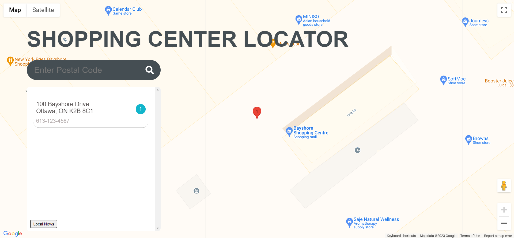
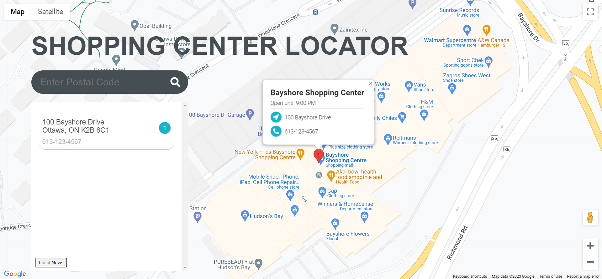

# P1-ShoppingMallsGenerator
## Main Task

To create a real-world front-end application that you’ll be able to showcase to potential employers.

## Requirements:

* Use a CSS framework other than Bootstrap.

* Be deployed to GitHub Pages.

* Be interactive (i.e., accept and respond to user input).

* Use at least two [server-side APIs](https://coding-boot-camp.github.io/full-stack/apis/api-resources).

* Does not use alerts, confirms, or prompts (use modals).

* Use client-side storage to store persistent data.

* Be responsive.

* Have a polished UI.

* Have a clean repository that meets quality coding standards (file structure, naming conventions, follows best practices for class/id naming conventions, indentation, quality comments, etc.).

* Have a quality README (with unique name, description, technologies used, screenshot, and link to deployed application).

> **(Main Task, Requirements / Project 1; CARL-VIRT-FSF-PT-04-2023, README.md 2023)** 

## Final Work Review

**"Always leave the code a little cleaner than when you found it."**  This action was applied to HTML, CSS and JAVASCRIPT. To create a real-world front-end application from scratch, we have used Jon Ducket's JAVASCRIPT & JQuery book, references for our style.css on Google, W3Schools, CSSPortal, Snyk and all ZOOM recordings (of previous classes). Looks much cleaner, organised and easier to find what you are looking for. Comments were added in JAVASCRIPT to show what was done and for what purpose.

> **(CARL-VIRT-FSF-PT-04-2023, Project 1 / README.md 2023)**
> **(JAVASCRIPT & JQUERRY, Jon Duckett, Wiley; First edition (June 30 2014) pages 14-292. )**

The following animation demonstrates the application functionality:

> **(Our group was not able to solve the newscatcher API issue. Only the GoogleMaps API is functioning. Still not functioning properly but we have an idea on what the application would look like once completed. )**

### How the front-end application looks now:

### How the front-end application would look like once completed and a search is successful:

The assignment can be viewed here: [P1-ShoppingMallsGenerator]( https://smarquis85.github.io/P1-ShoppingMallsGenerator/)
